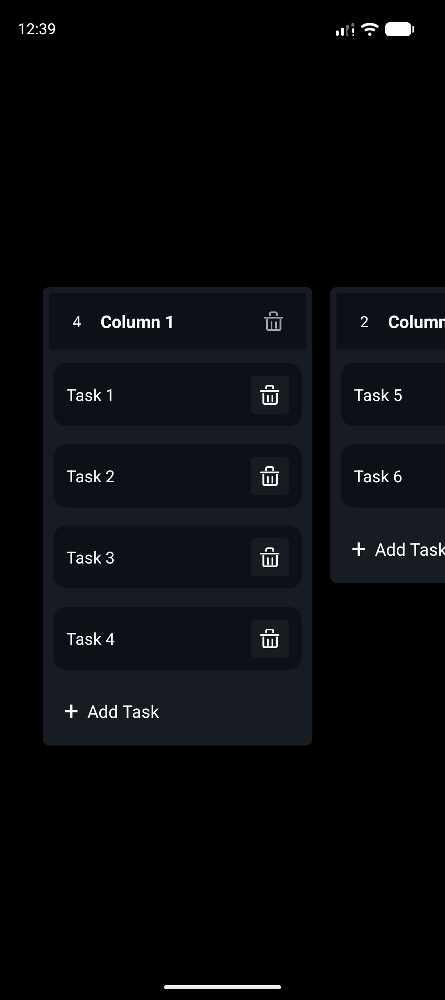

# Kanban Mobile

A mobile-friendly Kanban board built with React Native and Expo. The app lets
you create columns and tasks, edit their content, delete items, and rearrange
the board with drag-and-drop interactions.

<p align="center">
  
</p>

## Features

- Create, edit, delete, and reorder columns.
- Create, edit, delete, move, and reorder tasks.
- Drag tasks between columns with drop previews.
- Auto-scroll while dragging across the board or inside long columns.
- Haptic feedback for supported devices.
- Local board persistence with AsyncStorage.
- Runs on Expo Go, native Expo targets, and the web.

## Tech Stack

- Expo SDK 54
- React 19
- React Native 0.81
- TypeScript
- React Native Reanimated
- AsyncStorage
- Expo Haptics

## Getting Started

Install dependencies:

```sh
npm install
```

Start the Expo development server:

```sh
npm run start
```

Then open the app with Expo Go, an emulator, a simulator, or the web target.

## Scripts

```sh
npm run start       # Start Expo
npm run android     # Start Expo for Android
npm run ios         # Start Expo for iOS
npm run web         # Start the web version
npm run web:build   # Export a static web build to dist/
npm run typecheck   # Run TypeScript checks
npm run lint        # Run ESLint
```

## Project Structure

```txt
src/
  App.tsx
  components/
    KanbanBoard.tsx
    ColumnContainer.tsx
    TaskCard.tsx
  icons/
  types.ts
```

## Development Notes

Use `npm run web` for quick browser-based development. Use `npm run web:build`
when you need a static web export in `dist/`.

Board data is stored locally on the device/browser, so changes persist between
sessions without requiring a backend.
